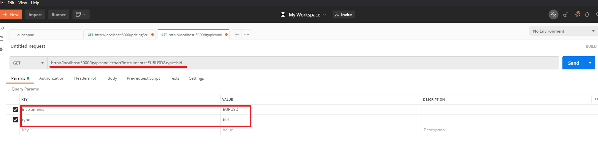
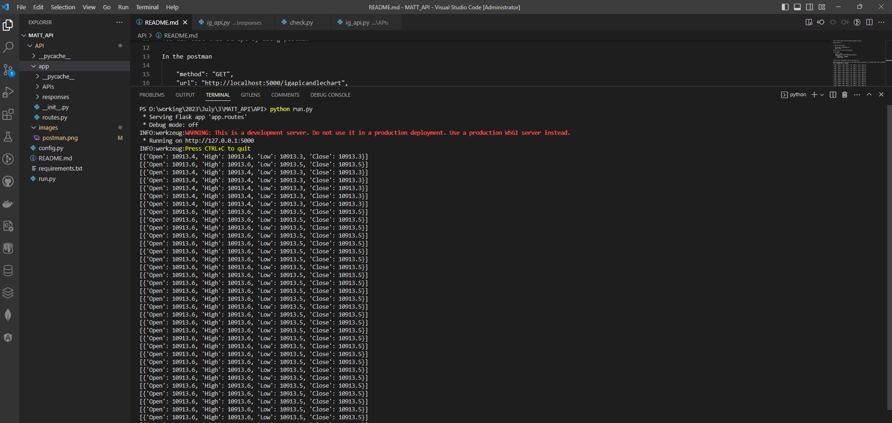

# IG API script to get real-time up-to-date price data

Python version 3.7

To run this flask project,

    pip install -r requirements.txt
    python run.py

You can test this script by using postman

In the postman

    "method": "GET",
    "url": "http://localhost:5000/igapicandlechart",
    "arguments": {
        "instruments": "DE30EUR",
        "type": "bid"
    },

You can see the list of "instruments" in the "SYMBOLS_IGAPI" constant in the [config.py](./config.py) file.

Using the above data as input data, the following response is displayed in the command window. Data is upgraded every 3 seconds.
Data is upgraded every 3 seconds.

[{'Open': 10912.6, 'High': 10912.7, 'Low': 10912.6, 'Close': 10912.7}],

[{'Open': 10912.6, 'High': 10912.7, 'Low': 10912.6, 'Close': 10912.7}],

[{'Open': 10912.7, 'High': 10913.2, 'Low': 10912.7, 'Close': 10913.1}],

[{'Open': 10913.0, 'High': 10913.0, 'Low': 10913.0, 'Close': 10913.0}],

[{'Open': 10912.9, 'High': 10912.9, 'Low': 10912.9, 'Close': 10912.9}],

[{'Open': 10912.7, 'High': 10912.7, 'Low': 10912.7, 'Close': 10912.7}],

[{'Open': 10912.6, 'High': 10912.6, 'Low': 10912.6, 'Close': 10912.6}],

[{'Open': 10912.6, 'High': 10912.6, 'Low': 10912.6, 'Close': 10912.6}],

[{'Open': 10912.5, 'High': 10912.5, 'Low': 10912.5, 'Close': 10912.5}],

[{'Open': 10912.8, 'High': 10912.8, 'Low': 10912.8, 'Close': 10912.8}],

[{'Open': 10913.2, 'High': 10913.2, 'Low': 10913.1, 'Close': 10913.1}],

[{'Open': 10913.0, 'High': 10913.0, 'Low': 10912.7, 'Close': 10912.7}],

.......

